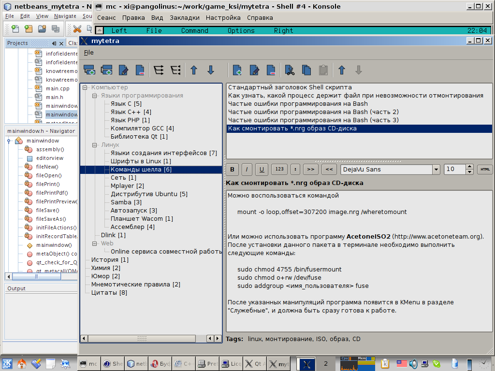

# Тестовая заметка

#test #note

Создание идеального помощника

В общем, я очутился в классической ситуации: хочешь получить что-то хорошее — сделай это сам. В тот момент я присматривался к плюсовому фреймверку Qt, который вышел в своей 4-й версии. И я решил, что нет ничего лучше, чем сделать свой собственный менеджер, который бы удовлетворял меня в меру моих собственных способностей. Даже если проект «не пойдет», я, как минимум, смогу на практике изучить перспективный кроссплатформенный фреймверк.

Я прочитал пару книжек, засел за программирование, и сделал первую минимальную версию программы. Я назвал её MyTetra. Выглядела она вот так:

Изначально я точил те мелочи, которых мне не хватало в других менеджерах: нормальное сворачивание в трей, разделение дерева на сущности «ветка» и «запись», подсчет количества записей в ветках, копипаст записей через буфер обмена. В первой версии даже не было поиска, но я начал наполнять базу своими записями, чтобы прочувствовать, можно ли удержать информацию в дереве, не уткнусь ли я в то, что мне потребуются различные «срезы» дерева (в необходимости автоматически реконфигурируемого дерева меня страстно убеждал один товарищ), возникнет ли необходимость группировки по разным признакам. И быстро понял, что дерево свою функцию «базиса» хорошо выполняет, особенно, если ты сам вырастил это дерево.

